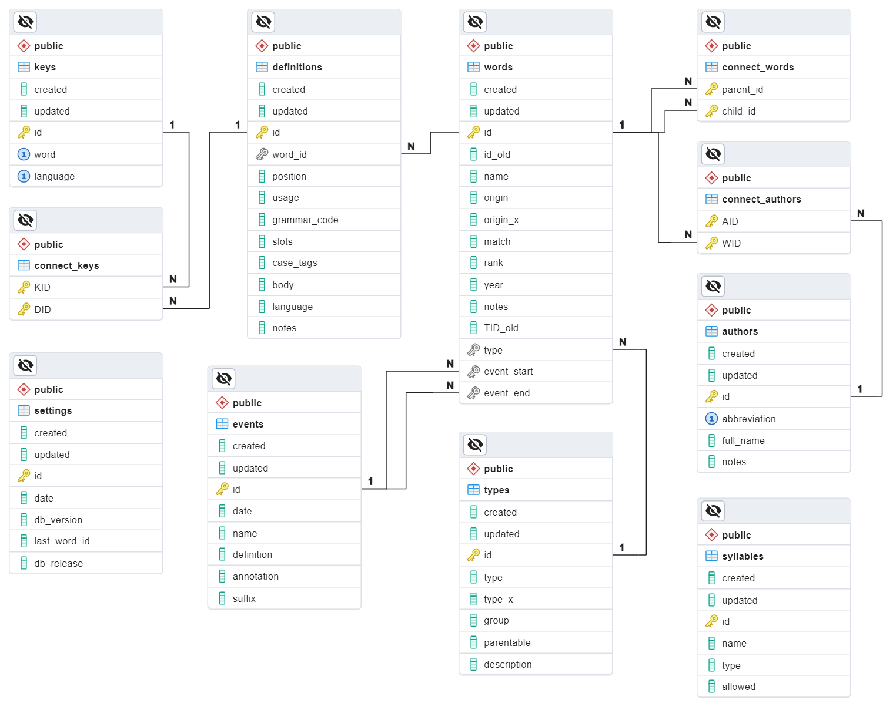

# Loglan Core


[](https://github.com/torrua/loglan_core/actions/workflows/pytest.yml)


# SQLAlchemy Database Model for Loglan Dictionary

This project represent a SQLAlchemy database model for the dictionary of [constructed language Loglan](http://www.loglan.org/). 
It contains schemas for information about words, authors, lexical events, and even more.



## Features
Provides a structured SQLAlchemy model for the Loglan dictionary.
Includes classes for handling words, authors, lexical events, and more.
Can be easily integrated into Python projects to provide Loglan language support.

## Prerequisites

Before installing, ensure you have the following software installed on your system:

- Python 3.10+
- pip (Python package manager)

## Installation
You can install Loglan-Core using pip:
```bash
pip install Loglan-Core
```

## Usage
After installing the package, you can use it as follows:

```bash
from loglan_core import Word, Type, Event, Key
# your code here...
```
For more details please see [Intro](examples/intro.md), [Word](examples/word.md) and [WordSelector](examples/word_selector.md) documentation with examples.

## License
Loglan-Core is licensed under the MIT license.